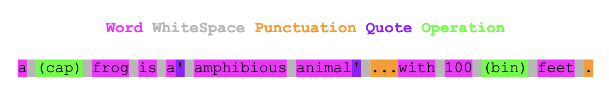
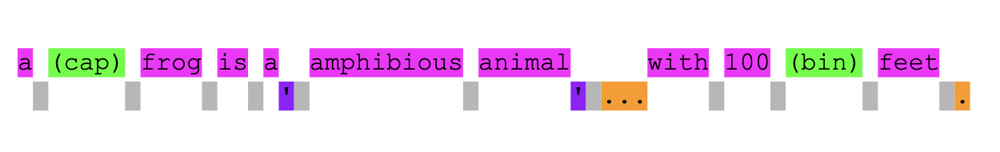

# goReloaded

## Usage
### Test:
```sh
$ go test
```


### Run the project:
```sh
$ go run . path_to_input path_to_output
```

## About

The string is split, and each substring becomes a token. The token stores data about the substring. For example, `Operation` tokens store a pointer to the function which applies the operation. Each token is a `struct`.

```go
type tokenKind int64

const (
	NoKind tokenKind = iota
	Word
	WhiteSpace
	Punctuation
	Quote
	Operation
)

type opData struct {
	ptr   *func(str string) string
	count int
}

type token struct {
	str  string
	kind tokenKind
	op   opData
}
```

Tokens are easier to work with when compared with an array of substrings, as observations of that substring can be done once and persisted. This reduces re-evaluation of that substring. Consider:

```go
for i := 0; i < token.op.count; i++
```

```go
for i := 0; i < getOperationCount(token); i++
```

Each word is broken down into tokens:


Each required modification is carried out using the information in each token.

To apply operations, only `Word` and `Operation` tokens are relevant. Other types are ignored as operations are always applied to previous words irrespective of punctuation, whitespace etc.


To use the correct article (`"A"` or `"An"`), punctuation is relevant. The `"a"` should not change to `"an"` here: `"I like the letter a, it is my favourite"`. So only `Word` and `Punctuation` tokens are relevant.


## Process
1. `input` file is read into a string.
2. String is tokenized. Each rune is assessed. If the current rune belongs to a different type of token from the previous rune, then a new token is created. For operations (which combine characters from other token types), regex is used to assess if the current rune is the first character of a substring which represents an operation. An `Operation` token is created, and the length of that substring is skipped before normal rune processing continues.
3. `Operation` tokens are applied to relevant previous `Word` tokens.
4. Other processing takes place, correcting indefinite articles (A/An), placing `WhiteSpace` in the correct place relative to `Punctuation` and `Quote` tokens. This is done while creating a new final string.
5. String is written to `output` file.
